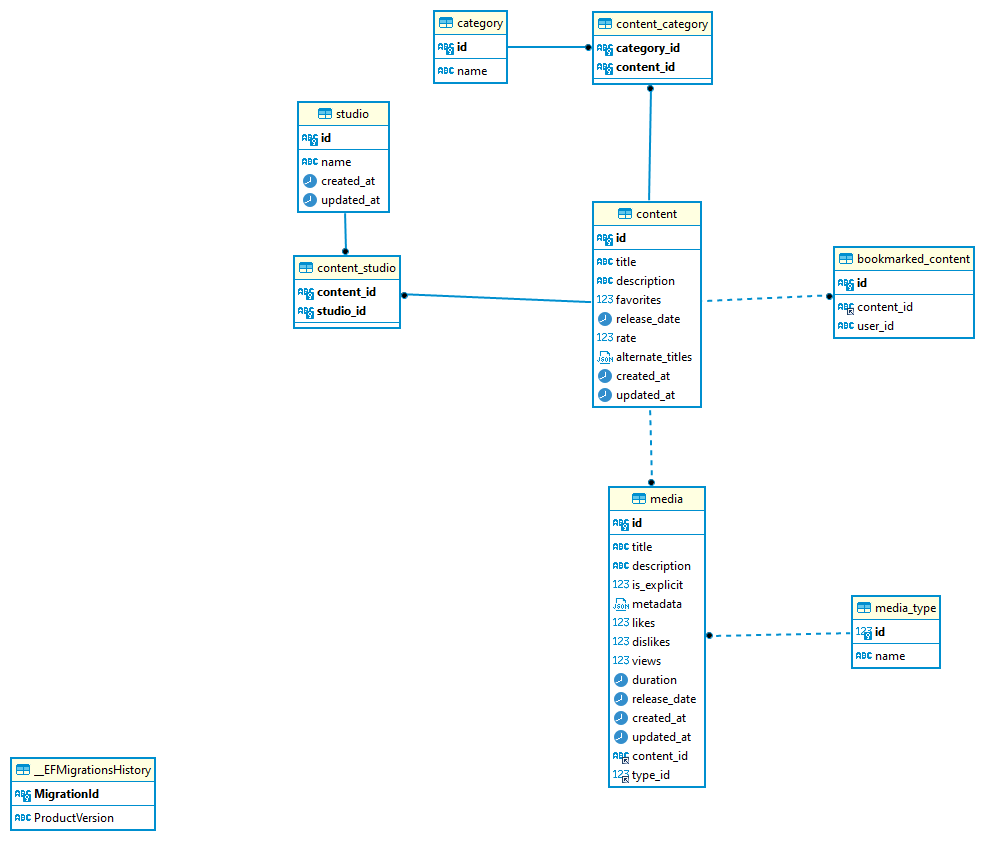

# **Introdução**

Este serviço disponibiliza informações de conteúdos, mídias referentes a conteúdos, possibilita o upload de novos conteúdos e mídias.

# **Informações Técnicas**
## Tecnologias
- .NET 6.0

## Padrões de projetos
- [Mediator](https://refactoring.guru/pt-br/design-patterns/mediator)
- [Unit Of Work](https://martinfowler.com/eaaCatalog/unitOfWork.html)

## Database

Banco de dados utilizado MySql na versão 8.0.32 

### _Modelo DER_

# **Executar**